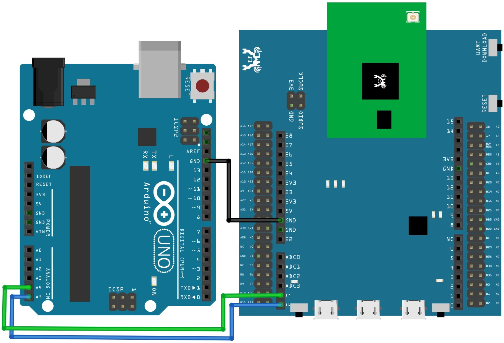

===
I2C
===

**class I2C – Inter-Integrated Circuit**

**Examples**

-  **I2C send and recv:**

Materials:

-  Ameba x 1

-  Arduino UNO x 1

..

   Steps:

   I2C is a very common module on microcontrollers, it only takes 2 wire
   and able to achieve data rate at up to 3.4Mbps. It works in
   master-slave model and a master can simultaneously connect to up to
   128 slaves, making it a very versatile communication protocol between
   microcontroller and sensor.

   Here we are going to use Ameba as an I2C master and Arduino UNO as a
   slave to achieve I2C send and recv.

   Before connection, make sure to upload the “Examples -> Wire ->
   Slave_receiver” example code to Arduino UNO.

   Connection is shown as follows, here we are using PA_26 as SDA pin
   and PA_25 as SCL.

   Note: There is currently 1 set of I2C available to MicroPython user,
   they are

==== ===== =====
Unit SDA   SCL
==== ===== =====
0    PA_26 PA_25
==== ===== =====

|per-5-5|

Then copy and paste the following code line by line into REPL to see
their effects.

**from** machine **import** Pin\ **,** I2C

i2c **=** I2C\ **(**\ scl **=** "PA_25"**,** sda **=** "PA_26"**,**
freq\ **=**\ 100000\ **)** # configure I2C with pins and freq. of 100KHz

i2c\ **.**\ scan\ **()**

i2c\ **.**\ writeto\ **(**\ 8\ **,** 123\ **)** # send 1 byte to slave
with address 8

i2c\ **.**\ readfrom\ **(**\ 8\ **,** 6\ **)** # receive 6 bytes from
slave

**Constructors**

**I2C(**\ *unit_id*\ [optional], “\ *sda_pin”*\ [required],
“\ *scl_pin”*\ [required], *frequency*\ [optional]\ **)**

Create a I2C object associated with the given pin name and configure it
using other parameters. This allows you to then read/write data on the
I2C bus.

-  **unit_id**: The unit ID of the hardware I2C, assume default value if
   left blank

-  **“sda_pin”**: The pin name of SDA

-  **“scl_pin”:** The pin name of SCL

-  **frequency:** The frequency at which I2C operates at, assume default
   value if left blank.

Note\ **:** All optional parameters have default values as follows,

========= ===========
Parameter Default
========= ===========
Unit_id   0
Frequency 100000 (Hz)
========= ===========

**Methods**

**I2C.reset()**

This method de-initializes the I2C device.

**I2C.scan()**

This method scans and return the available I2C addresses.

**I2C.readinto(** *buf*\ [required], *flag*\ [optional]\ **)**

This method reads the data received at I2C buffer into a user-declared
buffer

-  **buf**: a buffer of string / array /byte array type

-  **flag**: a Boolean flag, if True then send a NACK at the end, vice
   versa

**I2C.write(**\ *buf*\ [required]\ **)**

This method sends data stored in the buffer.

-  **buf:** a buffer of string / array /byte array type

**I2C.readfrom(**\ *addr*\ [required], *len*\ [required],
*stop*\ [optional]\ **)**

This method reads len bytes of data from given address, if stop is True,
then send a STOP bit at the end of the transmission.

-  **addr**: the address to read from

-  **len**: the number of bytes to expect

-  **stop**: a Boolean flag whether or not to send a STOP bit at the end
   of transmission

**I2C.readfrom_into(**\ *addr*\ [required], *buf*\ [required],
*stop*\ [optional]\ **)**

This method reads data from given address into the user-declared buffer
provided, if stop is True, then send a STOP bit at the end of the
transmission.

-  **addr**: the address to read from

-  **buf**: a data buffer of string / array/ byte array type

-  **stop**: a Boolean flag, if True then send a STOP bit at the end of
   transmission, vice versa

**I2C.writeto(**\ *addr*\ [required], *value*\ [required],
*stop*\ [optional]\ **)**

This method sends an integer value to the given address, if stop is
True, then send a STOP bit at the end of the transmission.

-  **addr**: the address to write to

-  **value**: an integer value to be sent over

-  **stop**: a Boolean flag, if True then send a STOP bit at the end of
   transmission, vice versa

