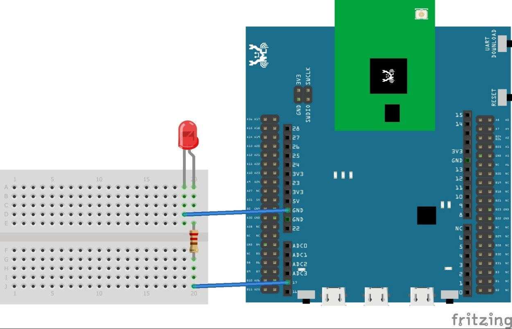

PWM
===

**class PWM – Pulse Width Modulation**

**Examples**

-  **LED fade:**

Materials:

-  Ameba x 1

-  LED x 1

-  resistor(220ohm) x 1

..

   Steps:

PWM use pulse width modulation to control output duty cycle and is
widely used to control LED brightness and motor. Here we are using an
LED to demonstrate how PWM works.

Let us connect pin PA_26 to the anode leg of an LED which in series with
a current limiting resistor and GND to cathode of the LED as shown
below,

|A circuit board Description automatically generated|

Then, copy and paste the following code line by line into REPL and hit
Enter. If everything is in order, you should be able to see the LED
slowly become brighter as you paste another line of code.

>>> from machine import Pin, PWM
>>> import time
>>> p = PWM(pin = "PA_26")
# 0 duty cycle thus output 0
>>> p.write(0.0)
# 10% duty cycle
>>> p.write(0.1)
# 50% duty cycle
>>> p.write(0.5)
# 100% duty cycle
>>> p.write(1.0)

**Constructors**

**PWM(**\ *unit*\ [optional]\ *, “pin_name”*\ [required]\ **)**

Create a PWM object associated with the given pin name. This allows you
to then write PWM signal on the pin.

-  **unit**: unit ID of the hardware PWM, will use default unit 0 if
   leave blank

-  **"pin_name"**: The name of the pin, must be in string format. See
   below for PWM supported pins.

**Note:**

PWM is currently only supported on the following pins,

PA_23, PA_24, PA_25, PA_26

**Methods**

**PWM.write(**\ *dutycycle_float*\ [required]\ **)**

This method will output a PWM signal with given duty cycle on the
associated GPIO pin.

-  **dutycycle_float**: a floating point duty cycle value, can be from
   0.0 (0%) to 1.0 (100%)

