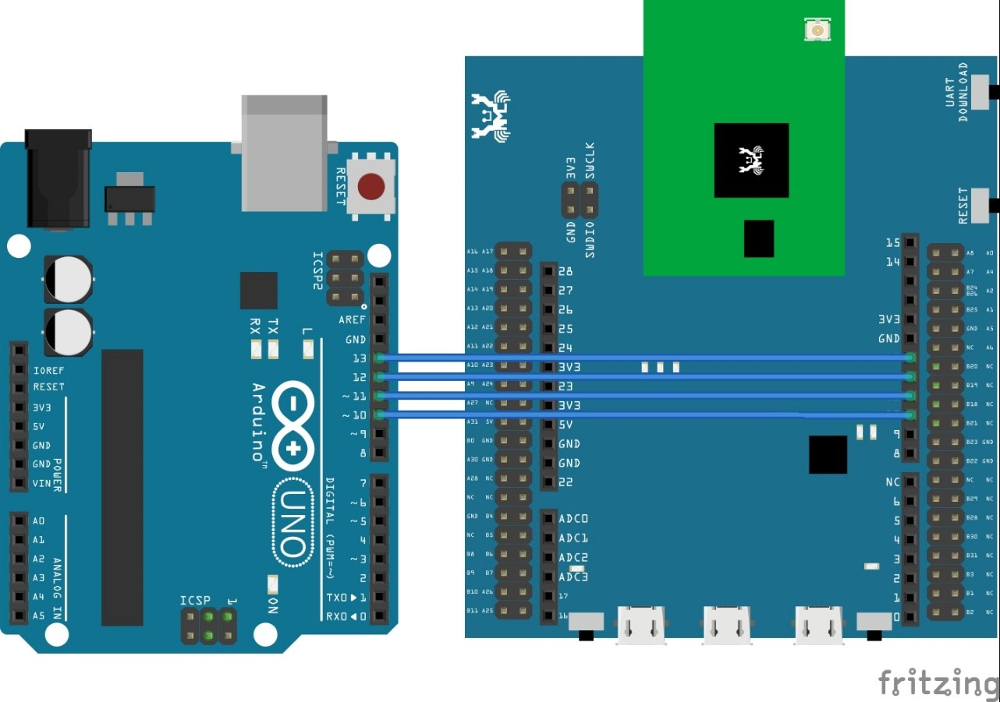

SPI
===

**class SPI – Serial Peripheral Interface**

**Examples**

-  **SPI slave recv:**

Materials:

-  Ameba x 1

-  Arduino UNO x 1

..

   Steps:

   SPI is a fast and robust communication protocol that are commonly
   found on many microcontrollers and is often used to retrieve sensor
   data or output image signal to a display. Ameba support SPI in both
   master and slave mode. Here we are going to see an example
   demonstrating how ameba receive data in slave mode on MicroPython.

   Before connection, make sure to upload the following code to your
   Arduino UNO.

///////////////////////

// SPI Master Write //

///////////////////////

#include <SPI.h>

void setup **(**\ void\ **)** **{**

Serial\ **.**\ begin\ **(**\ 115200\ **);** //set baud rate to 115200
for usart

digitalWrite\ **(**\ SS\ **,** HIGH\ **);** // disable Slave Select

SPI\ **.**\ begin **();**

**}**

void loop **(**\ void\ **)** **{**

char c\ **;**

digitalWrite\ **(**\ SS\ **,** LOW\ **);** // enable Slave Select

// send test string

**for** **(**\ const char **\*** p **=** "Hello, world!\r" **;** c **=**
**\***\ p\ **;** p\ **++)** **{**

SPI\ **.**\ transfer\ **(**\ c\ **);**

Serial\ **.**\ print\ **(**\ c\ **);**

**}**

Serial\ **.**\ println\ **();**

digitalWrite\ **(**\ SS\ **,** HIGH\ **);** // disable Slave Select

delay\ **(**\ 2000\ **);**

**}**

   Connection is shown as follows, here we are using unit 0 as SPI
   slave, and Arduino UNO as SPI master,

   |image1|

Then copy and paste the following code into REPL under paste mode to see
their effects.

>>> from machine import SPI
>>> s1= SPI(0 , mode = SPI.SLAVE)
>>> for i in range(14):
    chr(s1.read())

**Constructors**

**SPI(**\ *unit_id*\ [required], *baudrate*\ [optional],
*polarity*\ [optional], *phase*\ [optional], *databits*\ [optional],
*firstbit*\ [optional], *miso*\ [optional], *mosi*\ [optional],
*sck*\ [optional], *mode*\ [optional]\ **)**

Create a SPI object and configure it using other parameters. This allows
you to then read/write data on the SPI bus.

-  **unit_id**: The unit ID of the hardware SPI, assume default value if
   left blank

-  **baudrate**: The speed of SPI

-  **polarity:** one of factor determining SPI mode. (deprecated)

-  **phase:** one of factor determining SPI mode. (deprecated)

-  **databits:** number of data bits

-  **Firstbit:** this determine whether first bit is MSB or LSB

-  **miso:** miso pin. (deprecated)

-  **mosi:** mosi pin. (deprecated)

-  **sck:** clock pin. (deprecated)

-  **mode**: either MASTER mode or SLAVE mode

Note\ **:** All optional parameters have default values as follows,

========= =============
Parameter Default
========= =============
Baudrate  2000000 Hz
Polarity  Inactive_low
Phase     Toggle_middle
Databits  8
Firstbit  MSB
Miso      N.A.
Mosi      N.A.
Sck       N.A.
Mode      MASTER
========= =============

There is currently 2 set of SPI, they are,

==== ===== ===== ===== =====
unit MOSI  MISO  SCK   CS
==== ===== ===== ===== =====
0    PB_18 PB_19 PB_20 PB_21
1    PB_4  PB_5  PB_6  PB_7
==== ===== ===== ===== =====

**Note**: both unit support master mode, but only **unit 0** supports
slave mode.

**Methods**

**SPI.read()**

This method waits and read data received in SPI buffer, then return the
data received. Works in both master and slave mode.

**SPI.write(** *value*\ [required]\ **)**

This method writes an integer value to SPI bus. Works in both master and
slave mode.

-  **value**: an integer value to be sent on SPI bus

