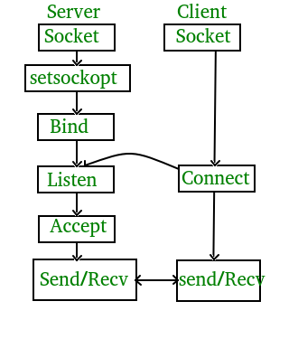

Socket
=======

**class socket – Socket Network Programming**

**Examples**

-  **Echo Server and Client example:**

Materials:

-  Ameba x 2

..

   Steps:

   After WiFi is set up, the best way to access the internet is to use
   socket. Socket is like an imaginary ethernet socket by which you use
   to connect your PC to some server on the internet like Google or
   Github. Application layer protocol like HTTP are also built on top of
   socket. Once you are given an IP address and a port number, you can
   start to connect to the remote device and talk to it.

   |image1|

   Here is an example of letting a server socket and a client socket to
   echo each other's message, to use this example, you need 2 ameba
   RTL8722 running MicroPython, copy and paste the following code to 2
   ameba respectively under REPL paste mode.

   This is the server code,

>>> import socket
>>> from wireless import WLAN
>>> wifi = WLAN(mode = WLAN.STA)
>>> wifi.connect(ssid = "YourWiFiSSID", pswd = "YourWiFiPassword") # change the ssid and pswd to yours
>>> s = socket.SOCK()
>>> port = 5000
>>> s.bind(port) 
>>> s.listen()
>>> conn, addr = s.accept()
>>> while True:
    data = conn.recv(1024)
    conn.send(data+"from server")

   This is the client code,

>>> import socket
>>> from wireless import WLAN
>>> wifi = WLAN(mode = WLAN.STA)
>>> wifi.connect(ssid = "YourWiFiSSID", pswd = "YourWiFiPassword") # change the ssid and pswd to yours
>>> c = socket.SOCK()
# make sure to check the server IP address and update in the next line of code
>>> c.connect("your server IP address", 5000) 
>>> c.send("hello world")
>>> data = c.recv(1024)
>>> print(data)

-  **Get information from HTTP website:**

Materials:

-  Ameba x 1

..

   Steps:

   With socket created, we can visit an HTTP website and get information
   from it. Copy and paste the following code into REPL under paste
   mode.

>>> import socket
>>> from wireless import WLAN
>>> wifi = WLAN(mode = WLAN.STA)
>>> wifi.connect(ssid = "YourWiFiSSID", pswd = "YourPassword") # change the ssid and pswd to yours
>>> def http_get(url):
    _, _, host, path = url.split('/', 3)
    c = socket.SOCK()
    # We are visiting MicroPython official website's test page
    c.connect(host, 80) 
    c.send(bytes('GET /%s HTTP/1.0\r\nHost: %s\r\n\r\n' % (path, host), 'utf8'))
    while True:
        data = c.recv(100)
        if data:
            print(str(data,'utf8'), end='')
        else:
            break
>>> http_get('http://micropython.org/ks/test.html')

**Constructors**

**socket.SOCK(**\ *domain*\ [optional], *type*\ [optional]\ **)**

Create a SOCK object and configure it with the given parameters. SOCK
class is under socket class and is the main class we use for all socket
level communications.

-  **domain**: domain address family type. Default is AF_INET

   -  **AF_INET**: IPv4, classic IP address with dot-notation that is
      slowly being replaced by IPv6 due to shortage.

   -  **AF_INET6**: IPv6, IP address with colon-notation

-  **type:** socket type, default is SOCK_STREAM

   -  **SOCK_STREAM:** TCP type

   -  **SOCK_DGRAM:** UDP type

**Methods**

**socket.SOCK.connect(**\ *host*\ [required], *port*\ [required]\ **)**

This method connects to a remote server as client.

-  **host:** a website address in string

-  **port:** port number in integer

**socket.SOCK.bind(**\ *port*\ [required]\ **)**

This method creates a server socket and binds it to the given port
number.

-  **port:** port number in integer

**socket.SOCK.listen()**

This method set the server to listening state, waiting for client
connection at the given port.

**socket.SOCK.accept()**

This method accepts a client connection and return a new socket object
for subsequent communication and client’s address.

**socket.SOCK.recv(**\ *length*\ [required]\ **)**

This method receive data with given length

-  **length:** the length of data expected to receive

**socket.SOCK.send(**\ *buffer*\ [required]\ **)**

This method sends data stored in the buffer

-  **buffer:** a data buffer in format of array/bytearray/string

**socket.SOCK.settimeout(**\ *seconds*\ [required]\ **)**

This method set socket’s timeout to the given value

-  **seconds:** new timeout in seconds

**socket.SOCK.close()**

This method close the socket.

